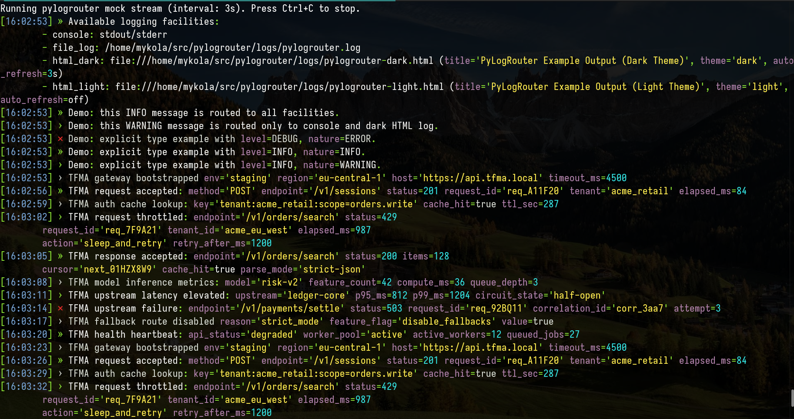
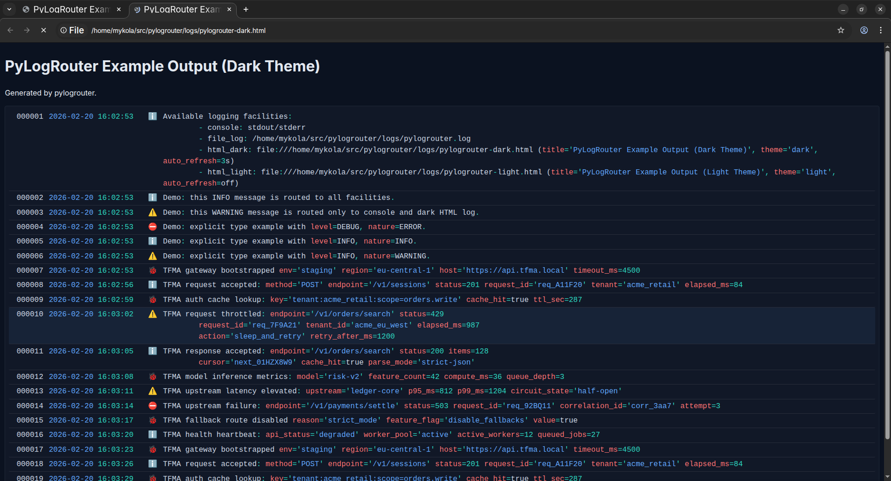
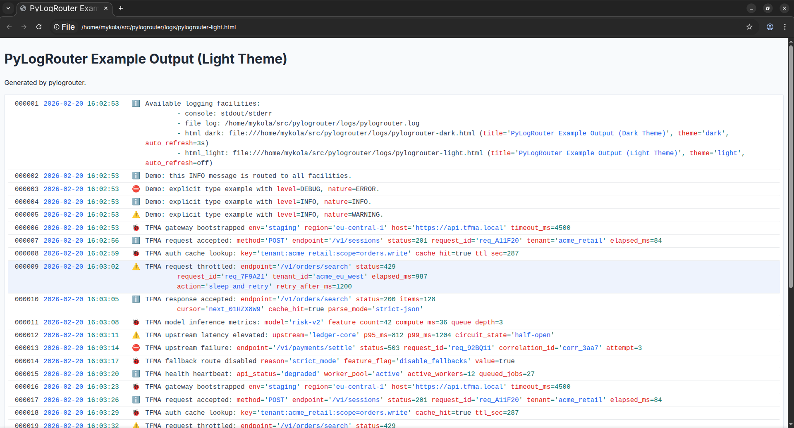

# pylogrouter

`pylogrouter` is a small library for routing log messages into multiple *facilities* (console, plain text file, HTML log) via a single API.

Why it exists:
- avoid duplicating `print + file write + html write` across a codebase;
- route one message to **all** outputs or only selected ones;
- get a readable **HTML log** for browser viewing (with syntax highlighting for `key=value`, quotes, numbers);
- keep it safe-by-default (escaping, limits, anti-flood, hardened log targets).

Repository: `https://github.com/mykolarudenko/pylogrouter`

---

## Install from Git (uv)

Option 1 — HTTPS:

```bash
uv pip install "pylogrouter @ git+https://github.com/mykolarudenko/pylogrouter.git"
```

Option 2 — SSH:

```bash
uv pip install "pylogrouter @ git+ssh://git@github.com/mykolarudenko/pylogrouter.git"
```

---

## Quick start

```python
from pylogrouter import LoggerRouter

logger = LoggerRouter(logger_level="DEBUG", logger_color=True)

logger.add_log_file(
    log_handle="file_log",
    log_file_path="logs/app.log",
    rotate_on_start=True,
    rotations_to_keep=2,
)

logger.add_html_log_file(
    log_handle="html_dark",
    log_file_path="logs/app-dark.html",
    title="App Log (Dark)",
    html_theme=LoggerRouter.THEME_DARK,
    html_auto_refresh_enabled=True,
    html_auto_refresh_seconds=3,
    rotate_on_start=True,
    rotations_to_keep=0,
)

logger.info("Hello to all facilities.")
logger.warning("Only console + html", handles=[LoggerRouter.HANDLE_CONSOLE, "html_dark"])
```

---

## Screenshots

### Console output



### HTML output (dark theme)



### HTML output (light theme)



---

## Usage / API reference (short)

### Singleton model
`LoggerRouter` is a singleton. Calling the constructor multiple times returns the same instance (and can reconfigure limits).

### Facilities and handles
- Each output channel has a string `handle`.
- `handles=None` routes to **all** active facilities.
- `handles=["console", "html_dark"]` routes only to selected targets.

### Levels and “nature”
- Convenience: `logger.debug(...)`, `logger.info(...)`, `logger.warning(...)`, `logger.error(...)`
- Explicit: `logger.log(message=..., level=..., nature=..., handles=...)`

### Plain file facility
- `add_log_file(...)` writes to a text file.
- Parent directories are created automatically.
- Rotation:
  - `rotate_on_start=True` with `rotations_to_keep=N` (startup rotation),
  - plus **size-based rotation**: if file exceeds `plain_log_max_file_size_bytes`, it rotates using `rotations_to_keep`.

### HTML facility
- `add_html_log_file(...)` writes a streaming HTML log (open it in a browser).
- Options:
  - `html_theme`: `"dark"` or `"light"` (default: `"dark"`),
  - `html_auto_refresh_enabled`: enables `<meta http-equiv="refresh">` (default: `False`),
  - `html_auto_refresh_seconds`: refresh interval when enabled (default: `10`).

### Mock stream
- `logger.mock_logger_output()` emits sample records (useful for previews).

### Throttling / anti-flood
If log write rate becomes too high, extra writes in the window are dropped:
- `max_writes_per_second` (default: `200`)
- `throttle_window_seconds` (default: `1`)

Stats:
```python
stats = logger.get_throttle_stats()
# {"dropped_total": ..., "dropped_by_handle": {...}}
```

---

## Security model

- HTML log:
  1) strict escaping (`escape_html_strict`) for all user-controlled fragments;
  2) strict post-render allowlist validation of the produced HTML fragment.

  If validation fails, the row is blocked from being written; the logger reports a security incident to console diagnostics and continues.

- Hardened log targets:
  - symlink and special files are rejected for file/html targets.

- Console output:
  - control characters (C0/C1) are normalized to avoid malicious ANSI/control sequences.

---

## Safety limits (defaults; override in `LoggerRouter(...)`)

- `max_message_length`: `32768`
- `max_message_lines`: `500`
- `max_line_length`: `4096`
- `max_log_handles_per_call`: `64`
- `colorize_timeout_ms`: `15` (if colorization exceeds budget, message is still published without syntax coloring)
- `max_html_document_bytes`: `10485760` (10 MiB)
- `max_html_title_length`: `256`
- `max_writes_per_second`: `200`
- `throttle_window_seconds`: `1`
- `plain_log_max_file_size_bytes`: `209715200` (200 MiB)
